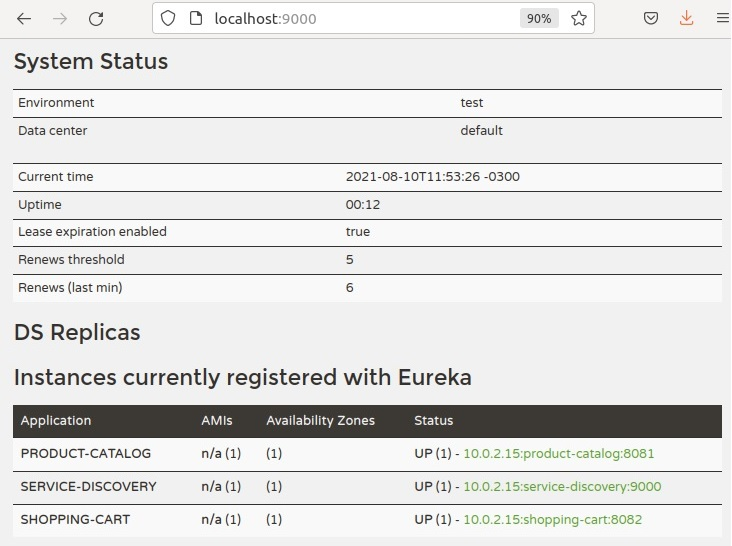

<hr/>
<div align="center">
    <h1>Desenvolvimento de aplicações com Java</h1>
    <h2><i>Arquitetura baseada em microsserviços usando Spring Cloud</i></h2>
    <a href="https://www.jetbrains.com/idea/" target="_blank"></a>
    <a href="https://www.java.com" target="_blank">  </a>
    <a href="https://www.docker.com/" target="_blank">  </a>  
    <h3>Este repositório é meu projeto do Bootcamp Java - Digital Innovation One.</h3>
    <a href="https://digitalinnovation.one/sign-in"></a>
    <i>Desenvolvimento de aplicações com Java</i>

<hr/>


### Docker compose
```` shell
sudo docker-compose up -d
````
### Actuator healthcheck (Teste server)
```` 
http://localhost:8081/actuator/health
http://localhost:8082/actuator/health
http://localhost:8088/actuator/health
http://localhost:8888/product-catalog/default
http://localhost:8888/shopping-cart/default
````
## Eureka Server
http://localhost:9000/


</div>
<hr/>
